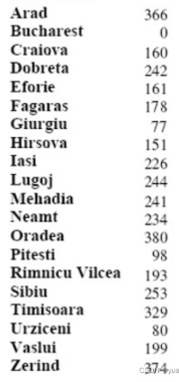
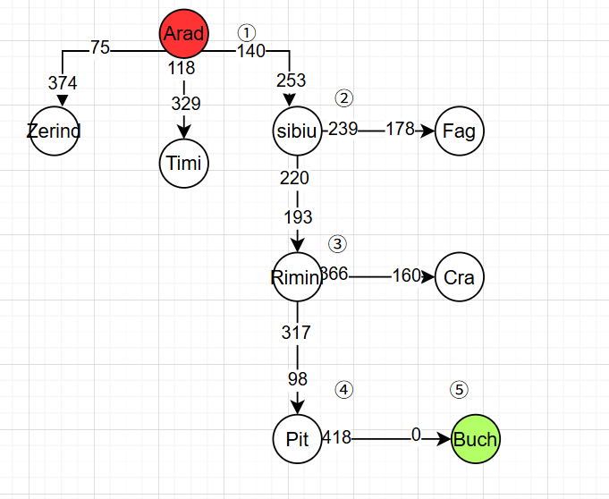
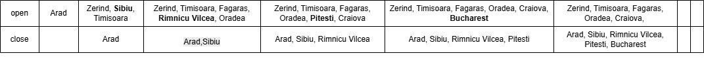

#  A*算法路径规划说明

## 一、算法简介

A*（A-Star）算法是一种**启发式搜索算法**，结合了：

- 广度优先搜索（BFS）的完整性
- Dijkstra算法的最优性

适用于**静态环境中的路径规划问题**，用于寻找起点到目标点的最短路径。

---

## 二、核心思想

A*算法通过评价函数进行路径选择：

f(x) = g(x) + h(x)
其中：
- g(x)：从起点到当前节点 x 的实际代价 ，到当前节点已经走过的路径 
- h(x)：从当前节点 x 到目标点的估计代价，使用启发函数来计算，根据具体问题，一般为欧元距离或者欧氏距离
---

## 三、启发函数 h(x)

常见方式：

- 欧几里得距离（直线距离）
- 曼哈顿距离（网格路径）

特殊情况：

- h(x) = 0 → Dijkstra算法，非启发式搜索
- g(x) = 0 → 贪婪搜索，无法保证找到解

---

## 四、A*算法特点

- OPEN表：存放待扩展节点
- CLOSED表：存放已访问节点
- 每次选择 f(x) 最小节点扩展
- 限制条件：在 h(x) ≤ 实际代价时保证最优解，g(x)>0

---

##  图3：题目

---
---

##  图：题目

---

---

## 五、算法执行过程（Arad → Bucharest）
---

### 图1：过程

---

### ① 初始节点 Arad

f(Arad) = 0 + 366 = 366

邻居节点：
- Zerind = 75 + 374 = 449
- Timișoara = 118 + 329 = 447
- Sibiu = 140 + 253 = 393 ✔

### ② 扩展 Sibiu

计算：
- Arad = 140 + 140 + 366 = 646
- Făgăraș = 140 + 99 + 179 = 415
- Oradea = 140 + 151 + 291 = 582
- Râmnicu Vâlcea = 140 + 80 + 193 = 414 ✔

---

###  图2：OPEN / CLOSED 表变化

---

### ③ 扩展 Râmnicu Vâlcea

计算：

- Craiova = 360 + 160 = 526
- Pitești = 317 + 100 = 417 ✔
- Sibiu（回访，舍弃）

---

### ④ 扩展 Pitești

计算：

- Sibiu = 591
- Bucharest = 450 + 0 = 450 ✔（终点）

---

## 六、OPEN / CLOSED表机制

- OPEN表：待扩展节点
- CLOSED表：已访问节点

流程：

1. 选择 OPEN 表中 f 最小节点
2. 移入 CLOSED 表
3. 扩展邻居节点
4. 更新 OPEN 表
5. 重复直到找到目标

---

## 七、路径回溯

从终点开始：
Bucharest ← Pitești ← Râmnicu Vâlcea ← Sibiu ← Arad

## 八、最终最优路径

Arad → Sibiu → Râmnicu Vâlcea → Pitești → Bucharest

---

## 九、总结

A*算法核心：
- g(x)：保证路径真实代价
- h(x)：提供搜索方向
- f(x)：控制搜索优先级

本质：**启发式最优路径搜索算法**